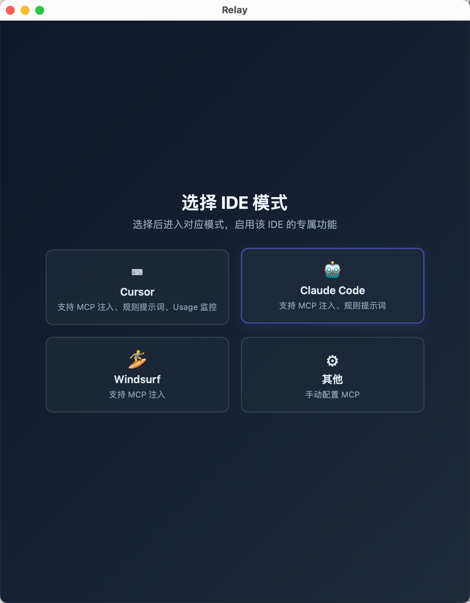
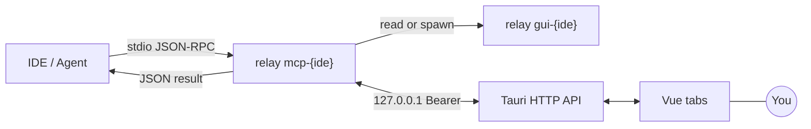

<div align="center">

<br/>


# Relay

### The missing human checkpoint for AI coding agents.

**Give your AI agent a "pause & ask" button — review, correct, or enrich every step before it runs.**

<p align="center">
  <a href="https://github.com/andeya/ide-relay-mcp/releases/latest"></a>
  <a href="LICENSE"></a>
  <a href="https://tauri.app/"></a>
  <a href="https://www.rust-lang.org/"></a>
  <a href="https://vuejs.org/"></a>
</p>

**[Download](https://github.com/andeya/ide-relay-mcp/releases/latest)** · **[简体中文](README_zh.md)**

**Author:** andeya · [andeyalee@outlook.com](mailto:andeyalee@outlook.com)

<br/>

</div>

<p align="center">
  
</p>
<p align="center"><sub><strong>Relay</strong> beside your IDE — the agent pauses, you review & answer, it continues. All in one <code>tools/call</code>.</sub></p>

---

## Why Relay?

AI coding agents are powerful — but **blindly autonomous agents are risky and wasteful**. Without a checkpoint, agents go on tangents, make mistakes that cascade into multiple correction rounds, and burn through your precious plan quota on wasted requests.

Relay adds a **human-in-the-loop (HITL) checkpoint** to any MCP-capable agent. The agent calls one tool — **`relay_interactive_feedback`** — and **blocks** until you submit your **Answer** (text, images, files). The result returns on the **same** JSON-RPC round trip. You catch issues early, guide accurately, and **make every request count** — no cloud dashboards, no extra SaaS, just a native desktop window beside your IDE.

### Key advantages

| | |
|---|---|
| **Works with any MCP IDE** | First-class support for **Cursor**, **Claude Code**, **Windsurf**, and a generic mode for others. |
| **100% local** | All data stays on your machine — loopback HTTP only, zero telemetry, no phone-home. |
| **One resident GUI** | A single persistent window (not a popup per request) with multi-tab session management. |
| **No ARG_MAX limits** | `retell` travels as HTTP JSON body (up to 16 MiB), not shell argv. |
| **Session continuity** | `relay_mcp_session_id` links turns into coherent sessions with **MM-DD HH:mm:ss** tab labels. |
| **Rich feedback** | Text, screenshots, file attachments — everything the agent needs in one round trip. |
| **Save your plan quota** | Catch mistakes early and guide precisely — no more wasted correction rounds burning through premium requests. |

---

## Multi-IDE support

Launch Relay and pick your IDE. Each mode unlocks IDE-specific features — one-click MCP injection, tailored rule prompts, and (for Cursor) real-time usage monitoring.

<p align="center">
  
</p>
<p align="center"><sub>Click a card to enter that IDE mode — all settings, CLI commands, and MCP config adapt automatically.</sub></p>

| IDE | MCP injection | Rule prompts | Usage monitoring |
|-----|:---:|:---:|:---:|
| **Cursor** | ✅ | ✅ | ✅ |
| **Claude Code** | ✅ | ✅ | — |
| **Windsurf** | ✅ | — | — |
| **Other** | manual | — | — |

---

## Quick start

**1. Install** — Grab the [latest release](https://github.com/andeya/ide-relay-mcp/releases/latest) (macOS, Linux, Windows) or [build from source](#build).

**macOS — Gatekeeper / quarantine:** CI-built `.app` bundles are **not** Apple-notarized (that requires a paid **Developer ID** certificate). Downloads from the browser get the `com.apple.quarantine` attribute, which can trigger “can’t be opened” or “damaged” warnings. Without a paid cert there is **no** fully automatic fix for all users; options are:

- **Recommended:** In Finder, **Control-click (or right-click) the app → Open** and confirm once (stores an exception for that app).
- **CLI (one-time):** clear quarantine after copying the app to `Applications` (adjust the path if yours differs):

```bash
xattr -dr com.apple.quarantine "/Applications/Relay.app"
```

**2. Launch & choose IDE** — Run `relay` and click your IDE card, or go directly:

```bash
relay gui-cursor        # Cursor mode
relay gui-claudecode    # Claude Code mode
relay gui-windsurf      # Windsurf mode
```

**3. Wire MCP** — Point your IDE at the Relay binary. Example for Cursor:

```json
{
  "mcpServers": {
    "relay-mcp": {
      "command": "/path/to/relay",
      "args": ["mcp-cursor"],
      "autoApprove": ["relay_interactive_feedback"]
    }
  }
}
```

> **Cursor** uses `.cursor/mcp.json` (per-repo, merged with `~/.cursor/mcp.json`).
> For **WSL agent + Windows `relay.exe`**, add `--exe_in_wsl`: `["mcp-cursor", "--exe_in_wsl"]`.
> See [docs/HTTP_IPC.md](docs/HTTP_IPC.md) for details.

Or use **Settings → Environment & MCP** inside Relay for one-click setup and to copy the MCP JSON directly:

<p align="center">
  
</p>
<p align="center"><sub><strong>Settings → Environment & MCP</strong> — PATH detection, one-click MCP injection, copy JSON, pause MCP.</sub></p>

**4. Install rule prompts** — Go to **Settings → Rule prompts** and install with one click. This teaches the agent to call `relay_interactive_feedback` every turn and maintain `relay_mcp_session_id`.

<p align="center">
  
</p>
<p align="center"><sub><strong>Settings → Rule prompts</strong> — one-click install into your IDE's rule configuration.</sub></p>

---

## Architecture



- **`relay mcp-{ide}`** — Stdio MCP server (`clap`). Handles `initialize`, `tools/list`, `tools/call`. Concurrent human rounds on one connection. Optional auto-reply rules.
- **`relay` / `relay gui-{ide}`** — Tauri app + HTTP on `127.0.0.1:0`. Writes `gui_endpoint_{ide}.json` with `{ port, token, pid }`; cleans up on exit.
- **Bridge** — MCP reads the endpoint file; if missing, spawns `gui-{ide}` and polls up to ~45 s. Then `POST /v1/feedback` → `GET /v1/feedback/wait/:id`. The wait resolves on submit, dismiss, supersede, or ~60 min idle.

---

## MCP tool: `relay_interactive_feedback`

| Argument | Required | Meaning |
|---|---|---|
| **`retell`** | **yes** (non-empty) | This turn's user-visible assistant reply, verbatim. |
| **`relay_mcp_session_id`** | if you have one | Continue the same session; returned in the JSON result. |
| **`commands`** | new tab: **required** | Array of IDE commands for slash-completion. `[]` only if the host truly has none. |
| **`skills`** | same as commands | Array of IDE skills. Same merge/dedupe rules. |

**Pause MCP** (Settings): sentinel `<<<RELAY_MCP_PAUSED>>>` — do not call again until resumed.

<p align="center">
  
</p>
<p align="center"><sub><strong>Slash completion</strong> — <code>commands</code> and <code>skills</code> populate the palette with optional category badges.</sub></p>

---

## Features at a glance

- **Multi-tab hub** — Each request opens or refreshes a tab. `relay_mcp_session_id` merges streams. Labels show **MM-DD HH:mm:ss** with turn-status color indicators.
- **Rich composer** — Enter to submit, Shift+Enter for newline, ⌘/Ctrl+Enter to submit & close. Paste images, attach files — they appear as `attachments` in the tool result.
- **Cursor Usage monitoring** — Auto-detect your Cursor token (cross-platform decryption), view plan quotas, request history, and predicted quota exhaustion in a live popover.
- **Auto-reply** — `auto_reply_oneshot.txt` / `auto_reply_loop.txt` for instant `0|reply` responses without opening the UI.
- **Local storage** — `feedback_log.txt`, `qa_archive/<session_id>.jsonl`, configurable attachment retention (default 30 days).
- **CLI** — `relay feedback --retell "…"` prints JSON on stdout; `--timeout` for CI/automation.

<p align="center">
  
</p>
<p align="center"><sub><strong>Settings → Cache</strong> — attachment + log usage, open folder, auto-clean.</sub></p>

---

## CLI reference

| Command | Role |
|---|---|
| `relay` | Open IDE selection page |
| `relay gui-cursor` | Launch GUI in Cursor mode |
| `relay gui-claudecode` | Launch GUI in Claude Code mode |
| `relay gui-windsurf` | Launch GUI in Windsurf mode |
| `relay mcp-cursor` | MCP stdio server for Cursor (what the IDE runs) |
| `relay mcp-claudecode` | MCP stdio server for Claude Code |
| `relay mcp-windsurf` | MCP stdio server for Windsurf |
| `relay feedback --retell "…"` | Terminal tryout; `--timeout`, `--relay-mcp-session-id` |

Only one GUI process per IDE mode is allowed; bare `relay` (no mode) can run multiple instances.

---

## Configuration & paths

Data lives under your OS application-data directory (`directories::ProjectDirs` → `config_dir()`):

| OS | Path |
|---|---|
| macOS | `~/Library/Application Support/com.relay.relay-mcp/` |
| Linux | `~/.config/relay-mcp/` |
| Windows | `%APPDATA%\relay\relay-mcp\config\` |

Key files: `feedback_log.txt`, `qa_archive/*.jsonl`, `ui_locale.json`, `gui_endpoint_{ide}.json`, `relay_gui_{ide}_alive.marker`, `mcp_pause.json`, `attachment_retention.json`, `auto_reply_*.txt`.

---

## Build

```bash
npm install
npm run build          # Vite frontend
cargo build --manifest-path src-tauri/Cargo.toml --release
npm run tauri build    # installers / .app / etc.
```

**Develop:**

```bash
npm run lint && npm run typecheck
npm run tauri:dev
```

**Icons** (from [`src-tauri/icons/source/relay-icon.svg`](src-tauri/icons/source/relay-icon.svg)):

```bash
npm run icons:build
```

CI: lint, typecheck, Vite, `cargo fmt`, `clippy -D warnings`, `cargo test` — see [docs/RELEASING.md](docs/RELEASING.md).

---

## Documentation

| Doc | Content |
|---|---|
| [docs/HTTP_IPC.md](docs/HTTP_IPC.md) | HTTP API, timeouts, WSL path rewrite |
| [docs/RELAY_MCP_SESSION_ID.md](docs/RELAY_MCP_SESSION_ID.md) | Session ID & tab labels |
| [docs/TERMINOLOGY.md](docs/TERMINOLOGY.md) | Vocabulary |
| [docs/RELEASING.md](docs/RELEASING.md) | Releases & CI |

---

## Privacy

**Data stays on device.** All answers, logs, attachments, and settings are written only under your OS user paths. The GUI and MCP process communicate over **127.0.0.1** — nothing leaves your machine.

**No telemetry.** Relay ships no analytics SDKs, crash reporters, or remote instrumentation. Local files like `feedback_log.txt` may contain sensitive content — handle them accordingly.

---

## Acknowledgements

Inspired by [interactive-feedback-mcp](https://github.com/junanchn/interactive-feedback-mcp). Relay replaces per-request subprocess UIs with a resident GUI and a Bearer-authenticated local HTTP layer.

---

## License

[MIT](LICENSE)
