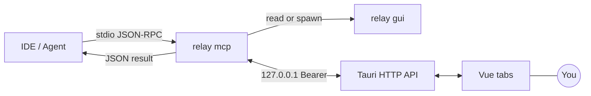

<div align="center">

<br/>


# Relay

**Local human-in-the-loop (HITL) client for the Model Context Protocol (MCP) — one `tools/call` round trip for your Answer.**

<p align="center">
  <a href="https://github.com/andeya/ide-relay-mcp/releases/latest"></a>
  <a href="LICENSE"></a>
  <a href="https://tauri.app/"></a>
  <a href="https://www.rust-lang.org/"></a>
  <a href="https://vuejs.org/"></a>
</p>

**[Download](https://github.com/andeya/ide-relay-mcp/releases/latest)** · **[简体中文](README_zh.md)**

**Author:** andeya · [andeyalee@outlook.com](mailto:andeyalee@outlook.com)

<br/>

</div>

---

**What it is.** **Relay** is a **native desktop** client (Tauri + Vue) that adds a **human-in-the-loop (HITL)** checkpoint to **MCP**-driven agents. A single tool — **`relay_interactive_feedback`** — **blocks** the pending `tools/call` until you submit an **Answer** (text, images, files). The result returns on the **same** JSON-RPC round trip. **`retell`** and payloads move over **loopback HTTP** as JSON (not shell argv), so large assistant text is not limited by **ARG_MAX**.

**What it is for.** Use cases that require **human review, correction, or extra context** before the next agent step: policy checks, QA sign-off, or any workflow where chat alone is not enough.

**What you gain.** **Data residency** (loopback-only traffic; data under your OS **application data** directory), **simple operations** (one persistent GUI; the IDE only launches **`relay mcp`** on stdio), **session continuity** (**`relay_mcp_session_id`**, tab titles **MM-DD HH:mm:ss**), and **bounded payloads** via HTTP body limits instead of process arguments.

**Who uses it.** Teams and individuals on **Cursor**, **Windsurf**, or any **MCP-capable IDE** who want a **local** approval surface—not a cloud dashboard or another SaaS subscription.

**Prior work.** [interactive-feedback-mcp](https://github.com/junanchn/interactive-feedback-mcp). Relay replaces one-off subprocess UIs with a **resident GUI** and a **Bearer-authenticated local HTTP** layer (Axum, **`gui_endpoint.json`** discovery).

<p align="center">
  
</p>
<p align="center"><sub><strong>Relay hub</strong> beside the IDE — submit an <strong>Answer</strong> while the same <code>tools/call</code> remains open.</sub></p>

---

## Contents

- **Why this shape** — HTTP `retell` (not argv), single GUI, session tabs
- **Quick start** — Install, `mcp.json`, Cursor / WSL
- **Architecture** — `relay mcp` ↔ HTTP ↔ GUI
- **Tool `relay_interactive_feedback`** — Arguments & slash palette
- **What you get** — Tabs, composer, storage, CLI
- **Binary surface** — `relay`, `relay mcp`, `relay feedback`
- **Configuration & paths** — Where data lives
- **Build** — Dev & release
- **Documentation** — `docs/` deep dives

---

## Why this shape

| Typical pain                                                                                  | What Relay does                                                                                                                                                    |
| --------------------------------------------------------------------------------------------- | ------------------------------------------------------------------------------------------------------------------------------------------------------------------ |
| **`retell`** (full assistant text) exceeds **ARG_MAX** / argv when passed on the command line | **`retell` in HTTP POST JSON** — bounded by body size (16 MiB), not the shell.                                                                                     |
| Spawning a UI per tool call                                                                   | **One GUI** (`relay` / `relay gui`); MCP only runs **`relay mcp`** on stdio.                                                                                       |
| Multiple IDE threads → tab chaos                                                              | **`relay_mcp_session_id`** in the tool result — pass it on the next call; labels **MM-DD HH:mm:ss** ([**RELAY_MCP_SESSION_ID.md**](docs/RELAY_MCP_SESSION_ID.md)). |

---

## Quick start

1. **Install** — Grab the [latest release](https://github.com/andeya/ide-relay-mcp/releases/latest) (macOS, Linux, Windows) or [build from source](#build).
2. **Wire MCP** — Point your IDE at the **`relay`** binary with args **`["mcp"]`**.

```json
{
  "mcpServers": {
    "relay-mcp": {
      "command": "/path/to/relay",
      "args": ["mcp"],
      "autoApprove": ["relay_interactive_feedback"]
    }
  }
}
```

**Cursor:** use **`.cursor/mcp.json`** in a repo (merged with **`~/.cursor/mcp.json`**). **WSL agent + Windows `relay.exe`:** add **`--exe_in_wsl`** to **`args`** (e.g. `["mcp", "--exe_in_wsl"]`) so attachment paths in tool results become `/mnt/c/...` ([docs/HTTP_IPC.md](docs/HTTP_IPC.md)).

```json
{
  "mcpServers": {
    "relay-mcp": {
      "command": "/path/to/relay.exe",
      "args": ["mcp", "--exe_in_wsl"],
      "autoApprove": ["relay_interactive_feedback"]
    }
  }
}
```

Repo template: [`mcp.json`](mcp.json). Semantics: **[docs/HTTP_IPC.md](docs/HTTP_IPC.md)**. Cursor reference: [MCP configuration locations](https://cursor.com/docs/context/mcp).

<p align="center">
  
</p>
<p align="center"><sub><strong>Settings → Environment & MCP</strong> — PATH, one-click <strong>Cursor / Windsurf</strong>, copy MCP JSON, <strong>Pause MCP</strong>.</sub></p>

**Rule prompts** (bilingual): **Settings → Rule prompts** — paste into IDE rules so the agent calls **`relay_interactive_feedback` every turn** and tracks **`relay_mcp_session_id`** ([`src/ideRulesTemplates.ts`](src/ideRulesTemplates.ts)).

---

## Architecture (fact-checked against the repo)

- **`relay mcp`** — Stdio MCP (`clap`). Handles `initialize`, `tools/list`, `tools/call`. Multiple human **`tools/call`** rounds may be in flight on one connection ([docs/HTTP_IPC.md](docs/HTTP_IPC.md) — router, workers, cap). Optional **auto-reply** (`0|…` lines in user-data rules) can return without opening the UI.
- **`relay` / `relay gui`** — Tauri app + **HTTP on `127.0.0.1:0`**. Writes **`{user_data}/gui_endpoint.json`** `{ port, token, pid }`; removes it on exit.
- **Bridge** — MCP reads the endpoint; if missing or unhealthy, **`spawn`s the same binary with `gui`**, polls up to **~45 s** (`ensure_gui_endpoint`). Then **`POST /v1/feedback`** → **`GET /v1/feedback/wait/:request_id`**. The wait ends on submit, dismiss, supersede, or **~60 min** idle; MCP uses a **24 h** read timeout as a failsafe. Tool JSON: **`{ relay_mcp_session_id, human, cmd_skill_count }`** plus optional **`attachments`** (`kind`, `path`; WSL path rewrite with **`relay mcp --exe_in_wsl`** — [docs/HTTP_IPC.md](docs/HTTP_IPC.md)).



---

## MCP tool: `relay_interactive_feedback`

| Argument                   | Required                                                                                                | Meaning                                                                                                                              |
| -------------------------- | ------------------------------------------------------------------------------------------------------- | ------------------------------------------------------------------------------------------------------------------------------------ |
| **`retell`**               | ✅ non-empty                                                                                            | This turn’s **user-visible assistant reply** (verbatim).                                                                             |
| **`relay_mcp_session_id`** | if you have one                                                                                         | Pass to continue the same session; returned in JSON.                                                                                 |
| **`commands`**             | new tab: **always** include; fill with **every** IDE command you can list — **`[]` only if** none exist | Slash-completion. With session: optional; **merged**, **dedupe by `id`**. If **`cmd_skill_count === 0`**, next call must repopulate. |
| **`skills`**               | same as `commands` for IDE **skills**                                                                   | Same merge / dedupe rules.                                                                                                           |

**Pause MCP** (Settings): sentinel **`<<<RELAY_MCP_PAUSED>>>`** — do not call again until resumed.

<p align="center">
  
</p>
<p align="center"><sub><strong>Slash completion</strong> — <code>commands</code> / <code>skills</code> populate the palette (optional <strong>category</strong> badges).</sub></p>

---

## What you get

- **Multi-tab hub** — New requests open or refresh tabs; inactive tabs can flash; **`relay_mcp_session_id`** merges streams; labels **MM-DD HH:mm:ss**.
- **Composer** — Enter submit, Shift+Enter newline, ⌘/Ctrl+Enter submit & close; images / paste; tool JSON may include **`attachments`** with **`human`** (legacy in-text markers stripped server-side).
- **Auto-reply** — `auto_reply_oneshot.txt` / `auto_reply_loop.txt` in user data; only **`0|reply`** lines (instant); see [Configuration](#configuration--paths).
- **Storage** — `feedback_log.txt`, **`qa_archive/<session_id>.jsonl`**, locale, **attachment retention** (default **30 days**, configurable in **Settings → Cache**).
- **CLI** — `relay feedback --retell "…"` prints JSON **Answer** on stdout; **exit 1** on GUI failure or **`--timeout`**.

<p align="center">
  
</p>
<p align="center"><sub><strong>Settings → Rule prompts</strong> — paste into IDE rules for human-in-the-loop.</sub></p>

<p align="center">
  
</p>
<p align="center"><sub><strong>Settings → Cache</strong> — attachment + log usage, <strong>Open folder</strong>, auto-clean.</sub></p>

---

## Binary surface

| Command                       | Role                                                                        |
| ----------------------------- | --------------------------------------------------------------------------- |
| `relay` · `relay gui`         | Hub + local HTTP                                                            |
| `relay mcp`                   | MCP stdio (what the IDE runs)                                               |
| `relay feedback --retell "…"` | Terminal tryout; `--timeout` (minutes), `--relay-mcp-session-id` (optional) |

There is **no** `relay window`; the IDE does not spawn per-request GUI children.

---

## Configuration & paths

| OS      | User data dir                              |
| ------- | ------------------------------------------ |
| macOS   | `~/Library/Application Support/relay-mcp/` |
| Linux   | `~/.config/relay-mcp/`                     |
| Windows | `%APPDATA%\relay-mcp\`                     |

Notable files: `feedback_log.txt`, `qa_archive/*.jsonl`, `ui_locale.json`, `gui_endpoint.json` (while GUI runs), `relay_gui_alive.marker`, `mcp_pause.json`, `attachment_retention.json`, `auto_reply_*.txt` (optional).

---

## Documentation

| Doc                                                          | What                                 |
| ------------------------------------------------------------ | ------------------------------------ |
| [docs/HTTP_IPC.md](docs/HTTP_IPC.md)                         | HTTP API, timeouts, WSL path rewrite |
| [docs/RELAY_MCP_SESSION_ID.md](docs/RELAY_MCP_SESSION_ID.md) | Session id & tab labels              |
| [docs/TERMINOLOGY.md](docs/TERMINOLOGY.md)                   | Vocabulary                           |
| [docs/RELEASING.md](docs/RELEASING.md)                       | Releases & CI                        |

---

## Build

```bash
npm install
npm run build          # Vite frontend
cargo build --manifest-path src-tauri/Cargo.toml --release
npm run tauri build    # installers / .app / etc.
```

**Develop:**

```bash
npm run lint && npm run typecheck   # ESLint: src/**/*.vue + src/**/*.ts
npm run tauri dev
```

**Icons** (from [`src-tauri/icons/source/relay-icon.svg`](src-tauri/icons/source/relay-icon.svg)):

```bash
npm run icons:build
```

CI (PR / `main`): lint, typecheck, Vite, `cargo fmt`, `clippy -D warnings`, `cargo test` — [docs/RELEASING.md](docs/RELEASING.md).

---

## Privacy

**Answers**, logs, and GUI state remain **on the local machine**. There is **no** built-in telemetry. Handle **`feedback_log.txt`** and MCP session logs as **sensitive** material.

---

## License

[MIT](LICENSE)
