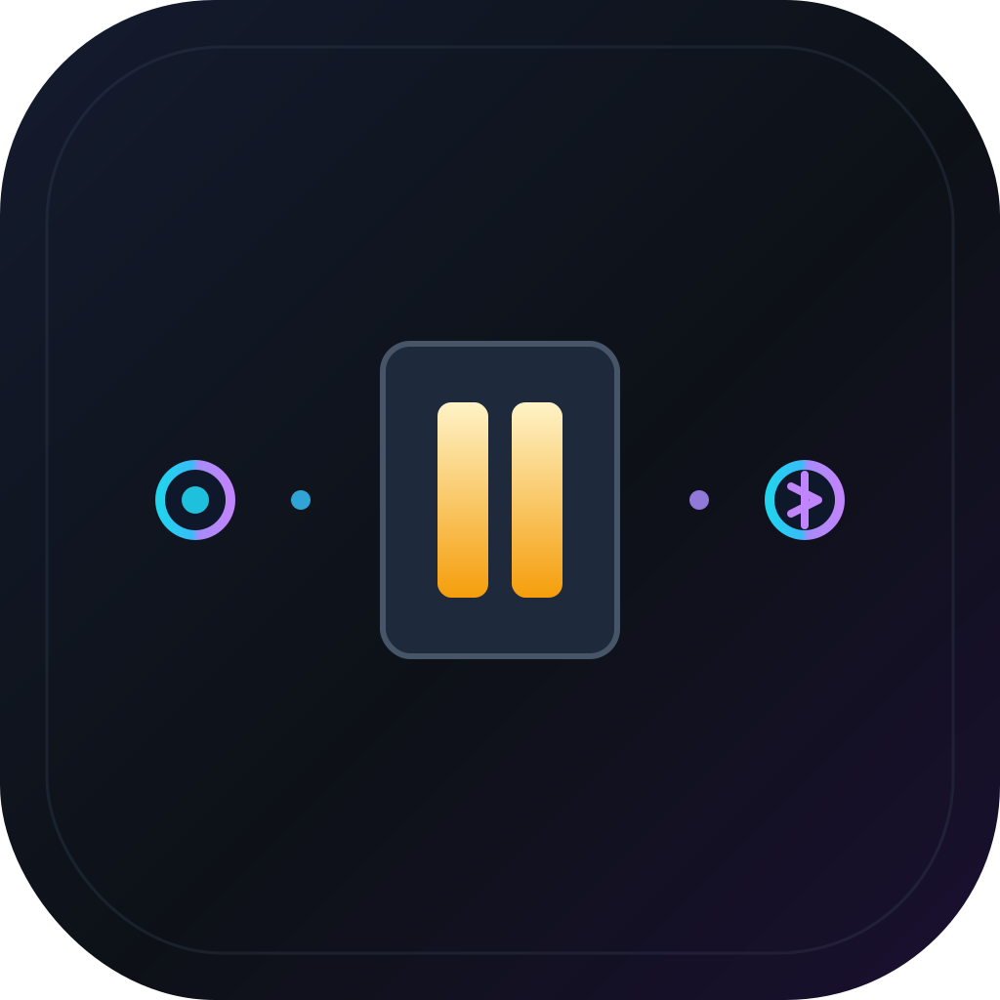
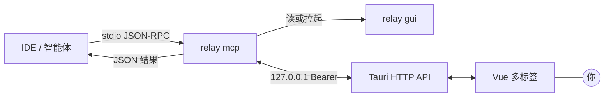
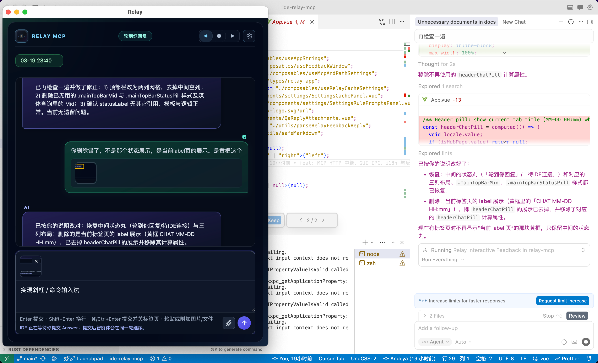
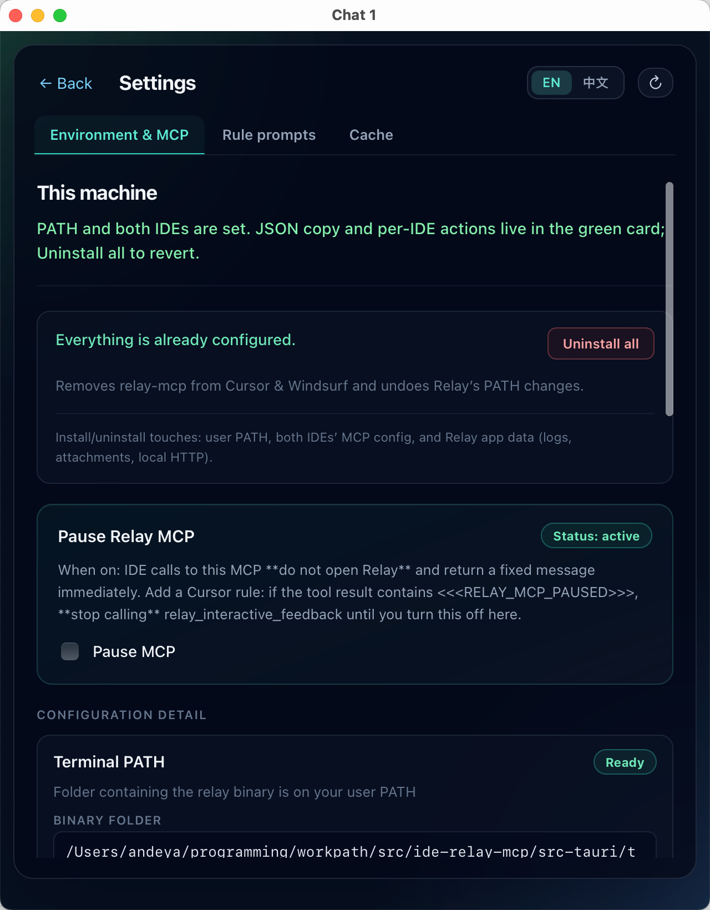
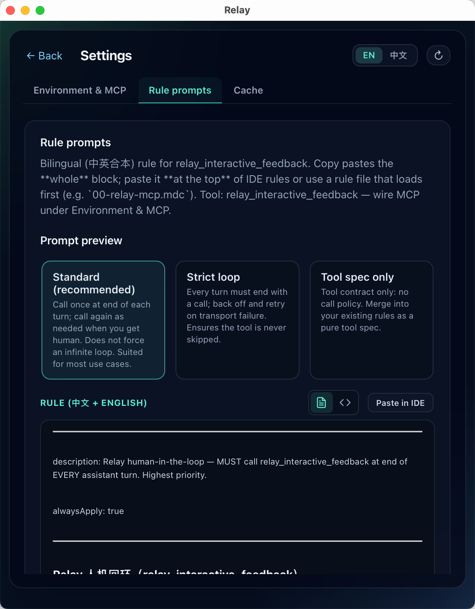
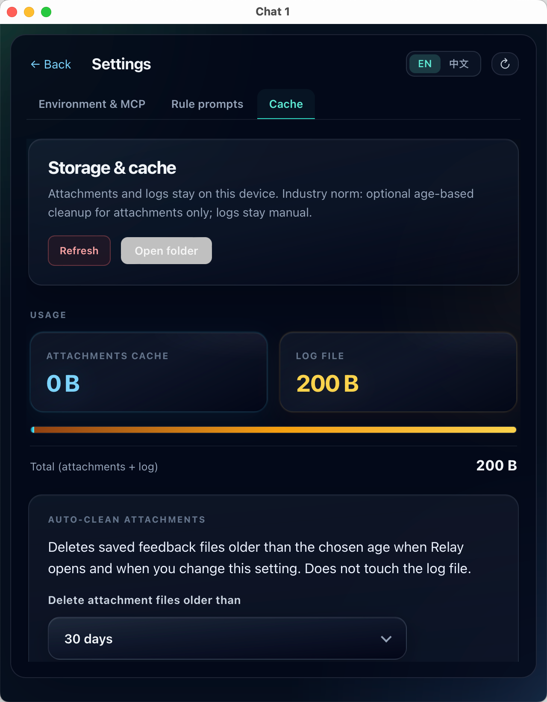

<div align="center">

<br/>



# Relay

**面向 MCP 的原生人机回路 — 单二进制、本机 HTTP、同一轮工具返回。**

<p align="center">
  <a href="https://github.com/andeya/ide-relay-mcp/releases/latest"></a>
  <a href="LICENSE"></a>
  <a href="https://tauri.app/"></a>
  <a href="https://www.rust-lang.org/"></a>
  <a href="https://vuejs.org/"></a>
</p>

**[下载](https://github.com/andeya/ide-relay-mcp/releases/latest)** · **[English](README.md)**

**作者：** andeya · [andeyalee@outlook.com](mailto:andeyalee@outlook.com)

<br/>

</div>

---

Relay 是一个 **MCP 服务**：把 **`relay_interactive_feedback`** 变成**阻塞式工具调用**——智能体暂停，**Tauri + Vue** 窗口收集你的 **Answer**，**同一次** JSON-RPC 往返即返回结果；不经云端中转，也不把超长助手正文塞进 shell argv。

思路参考 [interactive-feedback-mcp](https://github.com/junanchn/interactive-feedback-mcp)；Relay 用**独立 GUI 进程**和精简的**回环 HTTP API**（Axum、Bearer、`gui_endpoint.json` 发现）替代按次拉起子进程的做法。

<p align="center">
  
</p>
<p align="center"><sub><strong>Relay 中心窗口</strong> 与 IDE 并排 — 在智能体阻塞于同一次 <code>tools/call</code> 时撰写 <strong>Answer</strong>（文字 + 贴图）。</sub></p>

---

## 为何采用这种结构

| 常见痛点                                               | Relay 的做法                                                                                                                                                               |
| ------------------------------------------------------ | -------------------------------------------------------------------------------------------------------------------------------------------------------------------------- |
| **Retell**（完整助手回复）撞上 **ARG_MAX** / argv 限制 | **`retell` 走 HTTP POST JSON** — 大小受请求体上限约束（16 MiB），而非 shell。                                                                                              |
| 每次工具调用都拉起 UI                                  | **单一 GUI 进程**（`relay` / `relay gui`）；MCP 仅在 stdio 上跑 **`relay mcp`**。                                                                                          |
| 多 IDE 线程 → 标签混乱                                 | **`relay_mcp_session_id`** — 工具返回带 session id 的 JSON；记住并在下次传入；标签标题 **MM-DD HH:mm:ss**（[**RELAY_MCP_SESSION_ID.md**](docs/RELAY_MCP_SESSION_ID.md)）。 |

---

## 架构（与仓库实现一致）

- **`relay mcp`** — stdio MCP（`clap` 子命令）。处理 `initialize`、`tools/list`、`tools/call`。同一条连接上可并发多路在进行中的人机 `tools/call`（路由器 + 工作线程，有上限；见 [docs/HTTP_IPC.md](docs/HTTP_IPC.md)）。可选**即时自动回复**（用户数据目录下规则文件的 **`0|…`** 行）可在不打开界面的情况下直接返回。
- **`relay` / `relay gui`** — Tauri 应用 + **`127.0.0.1:0` 上的 HTTP**。写入 **`{user_data}/gui_endpoint.json`** `{ port, token, pid }`；退出时删除。
- **桥接** — 每次交互前 MCP 读取端点文件；若缺失或不健康，**以参数 `gui` 拉起同一可执行文件**，轮询至多 **~45 s**（`ensure_gui_endpoint`）。随后 **`POST /v1/feedback`** → **`GET /v1/feedback/wait/:request_id`**。GUI 在用户提交、关闭、被同会话新请求顶替，或 **约 60 分钟**无操作（服务端后台任务）时结束该 GET；MCP 侧 HTTP 客户端对这次 GET 另设 **24 小时**读超时作为兜底。响应为 **JSON** `{relay_mcp_session_id, human, cmd_skill_count, relay_gui_platform}`（`relay_gui_platform` 为 **GUI** 所在系统；**Linux 上的 `relay mcp`**（含 WSL）在 `relay_gui_platform` 为 `windows` 时会将 `attachments` 中可识别的 Windows 路径**替换**为 `/mnt/…`，不再保留原 Windows 路径）。详见 [docs/HTTP_IPC.md](docs/HTTP_IPC.md)。



完整 API 与安全说明：**[docs/HTTP_IPC.md](docs/HTTP_IPC.md)**。

---

## MCP 工具：`relay_interactive_feedback`

| 参数                       | 必填                                                                                                        | 含义                                                                                                                              |
| -------------------------- | ----------------------------------------------------------------------------------------------------------- | --------------------------------------------------------------------------------------------------------------------------------- |
| **`retell`**               | ✅ 非空                                                                                                     | 本轮**用户可见的助手回复**（原文）。                                                                                              |
| **`relay_mcp_session_id`** | 有则必传                                                                                                    | 回到同一会话时传入；工具返回的 JSON 中带此字段。                                                                                  |
| **`commands`**             | 新标签：每次**必须**带数组；填入当前 IDE **能枚举到的全部** commands；**仅当宿主确实没有任何项时**才为 `[]` | 斜杠补全。有 session：可选；若传入则**合并**并按 **`id` 去重**。上一轮 **`cmd_skill_count === 0`** 时下一轮须同样重新带齐两数组。 |
| **`skills`**               | 与 `commands` 同意图，对象为 **skills**                                                                     | 同上。                                                                                                                            |

**暂停 MCP**（设置）：工具返回哨兵 `<<<RELAY_MCP_PAUSED>>>` — 恢复前智能体不应再次调用。

<p align="center">
  
</p>
<p align="center"><sub><strong>斜杠补全</strong> — MCP 传入的 <code>commands</code> / <code>skills</code> 出现在输入框上方（可选 <strong>category</strong> 徽标）。</sub></p>

---

## 快速开始

1. **获取 Relay** — 推荐从 [最新发布](https://github.com/andeya/ide-relay-mcp/releases/latest) 下载已编译的安装包（macOS、Linux、Windows）。也可 [从源码构建](#构建)：`npm ci && npm run build && npm run tauri build`。
2. 将 IDE 的 MCP 指向 **`relay` 可执行文件**，参数 **`["mcp"]`**。

```json
{
  "mcpServers": {
    "relay-mcp": {
      "command": "/path/to/relay",
      "args": ["mcp"],
      "autoApprove": ["relay_interactive_feedback"]
    }
  }
}
```

<p align="center">
  
</p>
<p align="center"><sub><strong>设置 → 环境与 MCP</strong> — 终端 PATH、<strong>Cursor / Windsurf</strong> 一键写入、复制 MCP JSON、<strong>暂停 MCP</strong>。</sub></p>

应用内 **设置 → 环境与 MCP**：复制 JSON、**Cursor / Windsurf** 一键安装、可选 **PATH** 持久化（Windows 注册表 / shell 配置）。规则提示词：**设置 → 规则提示词**（中英合本规则 + 各 IDE 粘贴说明）；源码：[`src/ideRulesTemplates.ts`](src/ideRulesTemplates.ts)。

仓库示例：[`mcp.json`](mcp.json)。

### 使用技巧

- 在 IDE 对话中对 AI 说 **「遵守 Relay 规则」**（或粘贴 **设置 → 规则提示词** 中的规则块），可提醒助手按约定**每回合调用** `relay_interactive_feedback`、在新标签时带上 **`commands` / `skills`**，并记住 **`relay_mcp_session_id`**，从而主动与 Relay **建立或延续同一会话**（具体行为仍取决于模型是否遵循规则）。

---

## 你能得到什么

- **多标签中心** — 新请求打开或刷新标签；非当前标签可闪烁；**`relay_mcp_session_id`** 合并同一会话流；标签标题 **MM-DD HH:mm:ss**。
- **编辑器体验** — Enter 提交、Shift+Enter 换行、⌘/Ctrl+Enter 提交并关闭标签；支持贴图；工具 / 等待接口在纯文本 **`human`** 外可返回 **`attachments`**（服务端仍会剥离正文中的旧版 marker）。
- **自动回复** — 用户数据目录下 `auto_reply_oneshot.txt` / `auto_reply_loop.txt`；仅 **`0|回复`** 行（即时）；见 [配置与路径](#配置与路径)。
- **存储** — `feedback_log.txt`（**`USER_REPLY` / `CLI_REPLY`** 为**用户 Answer 明文**；旧版整段工具 JSON 行 hydrate **不参与配对**）、**`qa_archive/<session_id>.jsonl`**（每轮对话完成追加一行 JSON，供 hydrate 在归档条数多于日志配对时使用）、界面语言、**附件自动清理**（默认 **30 天**，可在 **设置 → 缓存** 中配置或关闭）。
- **CLI** — `relay feedback --retell "…"` 将 JSON **Answer** 打到 stdout；GUI 失败或 **`--timeout`** 时 **退出码 1**。

<p align="center">
  
</p>
<p align="center"><sub><strong>设置 → 规则提示词</strong> — 标准 / 严格循环 / 仅工具说明；<strong>粘贴到 IDE</strong> 做人机回路规则。</sub></p>

<p align="center">
  
</p>
<p align="center"><sub><strong>设置 → 缓存</strong> — 本机附件与日志占用、<strong>打开文件夹</strong>、附件自动清理（默认 <strong>30 天</strong>）。</sub></p>

---

## 可执行文件与子命令

| 命令                          | 作用                                                            |
| ----------------------------- | --------------------------------------------------------------- |
| `relay` · `relay gui`         | 中心窗口 + 本机 HTTP 服务                                       |
| `relay mcp`                   | MCP stdio（IDE 实际运行的命令）                                 |
| `relay feedback --retell "…"` | 终端试用；`--timeout`（分钟）、`--relay-mcp-session-id`（可选） |

**没有** `relay window`；IDE 不会按请求拉起 GUI 子进程。

---

## 配置与路径

| 系统    | 用户数据目录                               |
| ------- | ------------------------------------------ |
| macOS   | `~/Library/Application Support/relay-mcp/` |
| Linux   | `~/.config/relay-mcp/`                     |
| Windows | `%APPDATA%\relay-mcp\`                     |

常见文件：`feedback_log.txt`、`qa_archive/*.jsonl`（可选会话轮次归档）、`ui_locale.json`、`gui_endpoint.json`（GUI 运行时）、`relay_gui_alive.marker`（心跳）、`mcp_pause.json`、`attachment_retention.json`、`auto_reply_*.txt`（可选）。

---

## 构建

```bash
npm install
npm run build          # Vite 前端
cargo build --manifest-path src-tauri/Cargo.toml --release
npm run tauri build    # 安装包 / .app 等
```

**开发：**

```bash
npm run lint && npm run typecheck   # ESLint：src/**/*.vue + src/**/*.ts
npm run tauri dev
```

**图标**（源文件 [`src-tauri/icons/source/relay-icon.svg`](src-tauri/icons/source/relay-icon.svg)）：

```bash
npm run icons:build
```

CI（PR / `main`）：lint、typecheck、Vite 构建、`cargo fmt`、`clippy -D warnings`、`cargo test` — 见 [docs/RELEASING.md](docs/RELEASING.md)。

---

## 隐私

所有 **Answer**、日志与 GUI 状态均保留在**本机**。无内置遥测。请将 **`feedback_log.txt`** 与 MCP 会话记录视为敏感信息。

---

## 许可证

[MIT](LICENSE)
