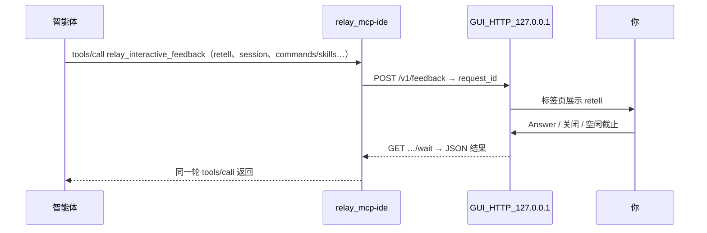
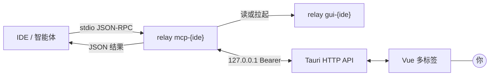

<div align="center">

<br/>


# Relay

### AI 编程智能体缺失的人工检查点。

**给你的 AI 智能体装上「暂停并询问」按钮 — 在它行动前，审阅、修正、补充每一步。**

<p align="center">
  <a href="https://github.com/andeya/ide-relay-mcp/releases/latest"></a>
  <a href="LICENSE"></a>
  <a href="https://tauri.app/"></a>
  <a href="https://www.rust-lang.org/"></a>
  <a href="https://vuejs.org/"></a>
</p>

**[下载](https://github.com/andeya/ide-relay-mcp/releases/latest)** · **[English](README.md)**

**作者：** andeya · [andeyalee@outlook.com](mailto:andeyalee@outlook.com)

<br/>

</div>

<p align="center">
  
</p>
<p align="center"><sub><strong>Relay</strong> 与 IDE 并排 — 智能体暂停等待，你审阅并回答，它继续执行。全程在一轮 <code>tools/call</code> 内完成。</sub></p>

---

## 为什么需要 Relay？

AI 编程智能体能力强大 — 但**完全放任的自动化暗藏风险，更浪费金钱**。没有检查点，智能体容易跑偏，错误层层叠加触发反复修正，白白消耗你宝贵的套餐请求次数。

Relay 为任意支持 MCP 的智能体插入**人机回路（HITL）检查点**。智能体调用唯一的 MCP 工具 — **`relay_interactive_feedback`** — 然后**阻塞等待**，直到你在本机提交 **Answer**（文字、截图、文件）。结果在**同一轮** JSON-RPC 往返中返回。及时纠偏、精准引导，**让每一次请求都用在刀刃上** — 无需云端控制台，无需额外 SaaS，只是你 IDE 旁的一个原生桌面窗口。

### 核心优势

|                      |                                                                                |
| -------------------- | ------------------------------------------------------------------------------ |
| **适配任意 MCP IDE** | 原生支持 **Cursor**、**Claude Code**、**Windsurf**，以及通用模式覆盖其它 IDE。 |
| **100% 本地**        | 数据全部留在本机 — 仅回环 HTTP，零遥测，绝不外传。                             |
| **一个常驻窗口**     | 单一持久化 GUI（非每次弹窗），多标签会话管理。                                 |
| **突破 ARG_MAX**     | `retell` 作为 HTTP JSON 传输（上限 16 MiB），不走 shell 传参。                 |
| **会话可延续**       | `relay_mcp_session_id` 串联回合，标签标注 **MM-DD HH:mm:ss**。                 |
| **丰富的反馈形式**   | 文字、截图、文件附件 — 智能体一次往返即可获取全部所需。                        |
| **节省套餐配额**     | 及时纠偏、精准引导，不再因反复修正浪费宝贵的请求次数，守护你的钱包。           |

---

## 多 IDE 支持

启动 Relay，选择你的 IDE。每种模式解锁对应 IDE 的专属功能 — 一键注入 MCP 配置、定制规则提示词，Cursor 模式还支持实时用量监控。

<p align="center">
  
</p>
<p align="center"><sub>点击卡片即进入对应模式 — 设置、CLI 命令、MCP 配置全部自动适配。</sub></p>

| IDE             | MCP 注入 | 规则提示词 | 用量监控 |
| --------------- | :------: | :--------: | :------: |
| **Cursor**      |    ✅    |     ✅     |    ✅    |
| **Claude Code** |    ✅    |     ✅     |    —     |
| **Windsurf**    |    ✅    |     —      |    —     |
| **其他**        |   手动   |     —      |    —     |

---

## 快速开始

**1. 安装** — [最新发布页](https://github.com/andeya/ide-relay-mcp/releases/latest)（macOS / Linux / Windows）或[从源码构建](#构建)。

**macOS — 门禁与隔离属性：** CI 构建的 `.app` **未**经 Apple **公证**（公证需要付费的 **Developer ID** 证书）。浏览器下载的应用会被打上 `com.apple.quarantine`，可能出现「无法打开」或「已损坏」提示。没有付费证书时**无法**从发布侧彻底消除该体验，只能引导用户：

- **推荐：** 在访达中对应用 **按住 Control 点按 → 打开**，首次确认后即可正常使用。
- **命令行（一次性）：** 将应用拷入「应用程序」后执行（路径请按实际修改）：

```bash
xattr -dr com.apple.quarantine "/Applications/Relay.app"
```

**2. 启动并选择 IDE** — 运行 `relay` 后点击 IDE 卡片，或直接指定：

```bash
relay gui-cursor        # Cursor 模式
relay gui-claudecode    # Claude Code 模式
relay gui-windsurf      # Windsurf 模式
```

**3. 接入 MCP** — 将 IDE 指向 Relay 可执行文件。Cursor 示例：

```json
{
  "mcpServers": {
    "relay-mcp": {
      "command": "/path/to/relay",
      "args": ["mcp-cursor"],
      "autoApprove": ["relay_interactive_feedback"]
    }
  }
}
```

> **Cursor** 可在仓库中放置 `.cursor/mcp.json`（与全局 `~/.cursor/mcp.json` 合并）。
> **WSL 内 Agent + Windows `relay.exe`**：`args` 加入 `--exe_in_wsl`，如 `["mcp-cursor", "--exe_in_wsl"]`。
> 详见 [docs/HTTP_IPC.md](docs/HTTP_IPC.md)。

或在 Relay 内通过 **设置 → 环境与 MCP** 一键配置，直接复制 MCP JSON：

<p align="center">
  
</p>
<p align="center"><sub><strong>设置 → 环境与 MCP</strong> — PATH 检测、一键注入 MCP、复制 JSON、暂停 MCP。</sub></p>

**4. 安装规则提示词** — 进入 **设置 → 规则提示词**，一键安装。这会指导智能体每回合调用 `relay_interactive_feedback` 并维护 `relay_mcp_session_id`。

<p align="center">
  
</p>
<p align="center"><sub><strong>设置 → 规则提示词</strong> — 一键安装到 IDE 的规则配置中。</sub></p>

**Cursor 规则文件** — 一键安装会把 **`relay-interactive-feedback.mdc`** 写入**用户**目录下的 `~/.cursor/rules/`（Windows：`%USERPROFILE%\.cursor\rules\`）。这与仓库内的 `.cursor/rules/` **不是同一路径**；若你只在项目里维护规则，请将文件复制或做符号链接过去。

**智能体仍不按回合调用工具？** 请确认：已启用 MCP **`relay-mcp`**；按提示批准 `relay_interactive_feedback`（或在 MCP JSON 中配置 `"autoApprove": ["relay_interactive_feedback"]`）；手动改盘上的规则后必要时**重载 Cursor**。规则文本是提示词约束，模型仍可能遗漏调用。

---

## Relay 人机回环（端到端）

完成上文快速开始第 2–4 步之后，每一轮大致如下（传输细节见 [docs/HTTP_IPC.md](docs/HTTP_IPC.md)，术语见 [docs/TERMINOLOGY.md](docs/TERMINOLOGY.md)）：



1. **MCP 进程** — IDE 启动 **`relay mcp-<cli_id>`**（stdio），例如 **`mcp-cursor`**。对应 GUI 为 **`relay gui-<cli_id>`**（通常已常驻）。
2. **调用工具** — **`retell`** 必填非空。**新会话：** **`relay_mcp_session_id`** 留空，且必须带 **`commands`** / **`skills`**（仅当宿主确实无可枚举项时才为 `[]`）。**延续会话：** 传入上一轮返回的 **`relay_mcp_session_id`**。
3. **MCP 连接 GUI** — 在 [配置与路径](#配置与路径) 目录读取 **`gui_endpoint_<cli_id>.json`**（如 **`gui_endpoint_cursor.json`**），或拉起 **`relay gui-<cli_id>`** 并等待健康检查（最长约 45 s）。随后 **`POST /v1/feedback`**，并在 **`GET /v1/feedback/wait/:id`** 上阻塞直至标签页结束。
4. **人工门控** — 提交 **Answer**、附件，关闭标签，或等待约 60 分钟空闲清理（返回空 **`human`**，对智能体等价于关闭）。
5. **同一轮 JSON-RPC 返回** — 含 **`relay_mcp_session_id`**、**`human`**、**`cmd_skill_count`**、可选 **`attachments`**。下一轮除非新开标签，否则**必须**带上该 **`relay_mcp_session_id`**。

**规则与 MCP：** 第 4 步「规则提示词」一键安装会把 **`relay-interactive-feedback.mdc`** 写到用户 **`~/.cursor/rules/`**（仅 Cursor）。规则用于**约束提示**；**真正执行回路**依赖 MCP 里启用 **`relay-mcp`** 并成功 **`tools/call`**。

---

## 架构



- **`relay mcp-{ide}`** — stdio MCP 服务器（`clap`）。处理 `initialize`、`tools/list`、`tools/call`，支持同连接多路并发。可选自动回复规则。
- **`relay` / `relay gui-<cli_id>`** — Tauri 应用 + `127.0.0.1:0` 上的 HTTP。写入 **`gui_endpoint_<cli_id>.json`**（例如 `gui_endpoint_cursor.json`），内含 `{ port, token, pid }`，退出时清理。
- **桥接** — MCP 读取端点文件；缺失时拉起 `gui-{ide}` 并轮询至多 ~45 s。之后 `POST /v1/feedback` → `GET /v1/feedback/wait/:id`。提交、关闭、顶替或 ~60 分钟空闲时结束等待。

---

## MCP 工具：`relay_interactive_feedback`

| 参数                       | 必填               | 含义                                                |
| -------------------------- | ------------------ | --------------------------------------------------- |
| **`retell`**               | **是**（非空）     | 本轮用户可见的助手回复原文。                        |
| **`relay_mcp_session_id`** | 有则必传           | 延续同一会话；工具返回中带此字段。                  |
| **`commands`**             | 新标签：**必须**带 | IDE 命令数组，供斜杠补全。仅当确实没有项时为 `[]`。 |
| **`skills`**               | 同 commands        | IDE 技能数组，合并去重规则相同。                    |

**暂停 MCP**（设置）：哨兵 `<<<RELAY_MCP_PAUSED>>>` — 恢复前勿再次调用。

<p align="center">
  
</p>
<p align="center"><sub><strong>斜杠补全</strong> — <code>commands</code> / <code>skills</code> 出现在输入框上方，支持分类徽标。</sub></p>

---

## 功能一览

- **多标签中心** — 每个请求打开或刷新标签，`relay_mcp_session_id` 合并会话流，标题显示 **MM-DD HH:mm:ss** 并以颜色指示回合状态。
- **富文本编辑器** — Enter 提交、Shift+Enter 换行、⌘/Ctrl+Enter 提交并关闭。贴图、附件，均作为 `attachments` 返回给工具调用。
- **Cursor 用量监控** — 跨平台自动解密 Cursor Token，查看套餐配额、请求历史、预测配额耗尽时间。
- **自动回复** — `auto_reply_oneshot.txt` / `auto_reply_loop.txt` 支持即时 `0|回复`，无需打开界面。
- **本地存储** — `feedback_log.txt`、`qa_archive/<session_id>.jsonl`，附件保留策略可配（默认 30 天）。
- **CLI** — `relay feedback --retell "…"` 输出 JSON 到 stdout；`--timeout` 适用于 CI / 自动化。

<p align="center">
  
</p>
<p align="center"><sub><strong>设置 → 缓存</strong> — 附件与日志占用统计、打开文件夹、自动清理。</sub></p>

---

## CLI 参考

| 命令                          | 作用                                             |
| ----------------------------- | ------------------------------------------------ |
| `relay`                       | 打开 IDE 选择页                                  |
| `relay gui-cursor`            | 以 Cursor 模式启动 GUI                           |
| `relay gui-claudecode`        | 以 Claude Code 模式启动 GUI                      |
| `relay gui-windsurf`          | 以 Windsurf 模式启动 GUI                         |
| `relay mcp-cursor`            | Cursor 的 MCP stdio 服务器（IDE 实际运行的命令） |
| `relay mcp-claudecode`        | Claude Code 的 MCP stdio 服务器                  |
| `relay mcp-windsurf`          | Windsurf 的 MCP stdio 服务器                     |
| `relay feedback --retell "…"` | 终端试用；`--timeout`、`--relay-mcp-session-id`  |

同一 IDE 模式仅允许一个 GUI 进程；无模式的 `relay` 可同时运行多个实例。

---

## 配置与路径

数据存放在操作系统应用数据目录下（`directories::ProjectDirs` → `config_dir()`）：

| 系统    | 路径                                                 |
| ------- | ---------------------------------------------------- |
| macOS   | `~/Library/Application Support/com.relay.relay-mcp/` |
| Linux   | `~/.config/relay-mcp/`                               |
| Windows | `%APPDATA%\relay\relay-mcp\config\`                  |

主要文件：`feedback_log.txt`、`qa_archive/*.jsonl`、`ui_locale.json`、**`gui_endpoint_<cli_id>.json`**（如 `gui_endpoint_cursor.json`）、**`relay_gui_<cli_id>_alive.marker`**、`mcp_pause.json`、`attachment_retention.json`、`auto_reply_*.txt`，以及部分场景下的遗留 `gui_endpoint.json`。

---

## 构建

```bash
npm install
npm run build          # Vite 前端
cargo build --manifest-path src-tauri/Cargo.toml --release
npm run tauri build    # 安装包 / .app 等
```

**开发：**

```bash
npm run lint && npm run typecheck
npm run tauri:dev
```

**图标**（源文件 [`src-tauri/icons/source/relay-icon.svg`](src-tauri/icons/source/relay-icon.svg)）：

```bash
npm run icons:build
```

CI：lint、typecheck、Vite、`cargo fmt`、`clippy -D warnings`、`cargo test` — 详见 [docs/RELEASING.md](docs/RELEASING.md)。

---

## 文档索引

| 文档                                                         | 内容                         |
| ------------------------------------------------------------ | ---------------------------- |
| [docs/HTTP_IPC.md](docs/HTTP_IPC.md)                         | HTTP API、超时、WSL 路径改写 |
| [docs/RELAY_MCP_SESSION_ID.md](docs/RELAY_MCP_SESSION_ID.md) | 会话 ID 与标签               |
| [docs/TERMINOLOGY.md](docs/TERMINOLOGY.md)                   | 术语 + 二进制与端点文件      |
| [docs/RELEASING.md](docs/RELEASING.md)                       | 发布与 CI                    |

---

## 隐私

**数据不出本机。** Answer、日志、附件、设置仅写入 OS 用户配置路径。GUI 与 MCP 进程经 **127.0.0.1** 通信，不指向公网。

**无遥测。** 不包含第三方统计 SDK、崩溃上报或远程打点。本地的 `feedback_log.txt` 等文件可能含敏感内容，请妥善保管。

---

## 致谢

思路来自 [interactive-feedback-mcp](https://github.com/junanchn/interactive-feedback-mcp)。Relay 以常驻 GUI 与 Bearer 鉴权的本地 HTTP 层替代按次拉起子进程的权宜做法。

---

## 许可证

[MIT](LICENSE)
