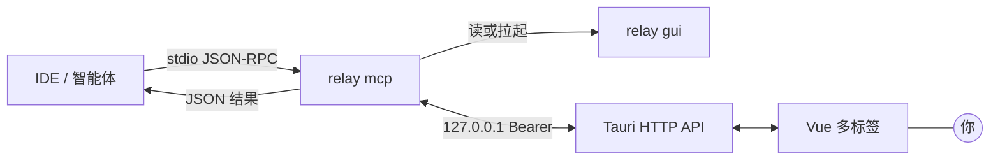

<div align="center">

<br/>


# Relay

**本地人机回路（HITL）客户端，面向模型上下文协议（MCP）— 单轮 `tools/call` 内完成 Answer 往返。**

<p align="center">
  <a href="https://github.com/andeya/ide-relay-mcp/releases/latest"></a>
  <a href="LICENSE"></a>
  <a href="https://tauri.app/"></a>
  <a href="https://www.rust-lang.org/"></a>
  <a href="https://vuejs.org/"></a>
</p>

**[下载](https://github.com/andeya/ide-relay-mcp/releases/latest)** · **[English](README.md)**

**作者：** andeya · [andeyalee@outlook.com](mailto:andeyalee@outlook.com)

<br/>

</div>

---

**产品是什么。** **Relay** 是面向 **MCP** 工作流的**原生桌面**客户端（Tauri + Vue），在智能体链路中插入**人机回路（HITL）**控制点：仅暴露 MCP 工具 **`relay_interactive_feedback`**，在 **`tools/call` 返回前阻塞**，直至你在本机提交 **Answer**（文字、贴图、文件）。结果仍在**同一轮** JSON-RPC 往返中返回。**`retell`** 与载荷经 **回环 HTTP** 以 JSON 传输，**不**走 shell 传参，故长段助手正文不受 **ARG_MAX** 等限制。

**解决什么问题。** 智能体在继续执行前，**必须先经人工确认、修订或补充材料**的情形：如质量门禁、合规审阅，或单靠对话无法交付、需要结构化反馈的流程。

**用户价值。** **数据驻留**（流量限于本机回环；数据落在操作系统**应用数据**目录）、**运维简单**（常驻单一 GUI；IDE 仅启动 **`relay mcp`** 的 stdio 进程）、**会话可延续**（**`relay_mcp_session_id`** 与标签 **MM-DD HH:mm:ss**），以及由 **HTTP 请求体上限**（而非进程参数）界定的**可预期载荷**。

**适用对象。** 使用 **Cursor**、**Windsurf** 或任意 **支持 MCP 的 IDE**，需要在**本机**完成人机协同、**不**依赖云端控制台或额外 SaaS 的团队与个人。

**前身与实现。** 思路来自 [interactive-feedback-mcp](https://github.com/junanchn/interactive-feedback-mcp)。Relay 以**常驻 GUI** 与 **Bearer 鉴权的本地 HTTP**（Axum、**`gui_endpoint.json`** 发现）替代按次拉起子进程的权宜做法。

<p align="center">
  
</p>
<p align="center"><sub><strong>Relay 中心窗口</strong> 与 IDE 并排 — 在同一未结束的 <code>tools/call</code> 上提交 <strong>Answer</strong>。</sub></p>

---

## 目录

- **为何采用这种结构** — `retell` 经 HTTP（非 argv）、单一 GUI、会话标签
- **快速开始** — 安装、`mcp.json`、Cursor / WSL
- **架构** — `relay mcp` ↔ HTTP ↔ GUI
- **工具 `relay_interactive_feedback`** — 参数与斜杠补全
- **你能得到什么** — 标签、编辑器、存储、CLI
- **子命令** — `relay`、`relay mcp`、`relay feedback`
- **配置与路径** — 数据目录
- **构建** — 开发与发布
- **文档索引** — `docs/` 深入阅读

---

## 为何采用这种结构

| 常见痛点                                                             | Relay 的做法                                                                                                                        |
| -------------------------------------------------------------------- | ----------------------------------------------------------------------------------------------------------------------------------- |
| 若把长段**助手正文**放在命令行里传递，会撞上 **ARG_MAX** / argv 限制 | **`retell` 放在 HTTP POST JSON 里** — 大小受请求体上限约束（16 MiB），不受 shell 传参长度限制。                                     |
| 每次工具调用都拉起 UI                                                | **单一 GUI**（`relay` / `relay gui`）；MCP 仅在 stdio 上跑 **`relay mcp`**。                                                        |
| 多路对话 → 标签混乱                                                  | **`relay_mcp_session_id`** — 下次调用传入；标签 **MM-DD HH:mm:ss**（[**RELAY_MCP_SESSION_ID.md**](docs/RELAY_MCP_SESSION_ID.md)）。 |

---

## 快速开始

1. **安装** — [最新发布页](https://github.com/andeya/ide-relay-mcp/releases/latest)（macOS / Linux / Windows）或 [从源码构建](#构建)。
2. **接入 MCP** — 将 IDE 指向 **`relay` 可执行文件**，参数 **`["mcp"]`**。

```json
{
  "mcpServers": {
    "relay-mcp": {
      "command": "/path/to/relay",
      "args": ["mcp"],
      "autoApprove": ["relay_interactive_feedback"]
    }
  }
}
```

**Cursor：** 可在仓库中放置 **`.cursor/mcp.json`**（与全局 **`~/.cursor/mcp.json`** 合并）。**WSL 内 Agent + Windows `relay.exe`：** 在 **`args`** 中加入 **`--exe_in_wsl`**（例如 `["mcp", "--exe_in_wsl"]`），工具结果中的附件路径会变为 `/mnt/c/...`（见 [docs/HTTP_IPC.md](docs/HTTP_IPC.md)）。

```json
{
  "mcpServers": {
    "relay-mcp": {
      "command": "/path/to/relay.exe",
      "args": ["mcp", "--exe_in_wsl"],
      "autoApprove": ["relay_interactive_feedback"]
    }
  }
}
```

仓库模板：[`mcp.json`](mcp.json)。语义与示例：**[docs/HTTP_IPC.md](docs/HTTP_IPC.md)**。官方说明：[Cursor MCP 配置位置](https://cursor.com/docs/context/mcp)。

<p align="center">
  
</p>
<p align="center"><sub><strong>设置 → 环境与 MCP</strong> — PATH、<strong>Cursor / Windsurf</strong> 一键写入、复制 MCP JSON、<strong>暂停 MCP</strong>。</sub></p>

**规则提示词**（中英合本）：**设置 → 规则提示词** — 粘贴到 IDE 规则，提醒智能体**每回合调用** `relay_interactive_feedback` 并维护 **`relay_mcp_session_id`**（源码 [`src/ideRulesTemplates.ts`](src/ideRulesTemplates.ts)）。

---

## 架构（与仓库实现一致）

- **`relay mcp`** — stdio MCP（`clap`）。处理 `initialize`、`tools/list`、`tools/call`。同一条连接上可并发多路人机 `tools/call`（见 [docs/HTTP_IPC.md](docs/HTTP_IPC.md)）。可选**即时自动回复**（规则文件 **`0|…`** 行）可在不打开界面时返回。
- **`relay` / `relay gui`** — Tauri 应用 + **`127.0.0.1:0` 上的 HTTP**。写入 **`{user_data}/gui_endpoint.json`**；退出时删除。
- **桥接** — MCP 读取端点；缺失或不健康时 **带 `gui` 拉起同一可执行文件**，轮询至多 **~45 s**。随后 **`POST /v1/feedback`** → **`GET /v1/feedback/wait/:request_id`**。提交、关闭、顶替或 **约 60 分钟**空闲时结束等待；MCP 侧另有 **24 小时**读超时兜底。工具 JSON：**`{ relay_mcp_session_id, human, cmd_skill_count }`**，可选 **`attachments`**（**`relay mcp --exe_in_wsl`** 路径改写见 [docs/HTTP_IPC.md](docs/HTTP_IPC.md)）。



---

## MCP 工具：`relay_interactive_feedback`

| 参数                       | 必填                                                                                 | 含义                                                                                                       |
| -------------------------- | ------------------------------------------------------------------------------------ | ---------------------------------------------------------------------------------------------------------- |
| **`retell`**               | ✅ 非空                                                                              | 本轮**用户可见的助手回复**（原文）。                                                                       |
| **`relay_mcp_session_id`** | 有则必传                                                                             | 延续同一会话；工具返回中带此字段。                                                                         |
| **`commands`**             | 新标签：每次**必须**带数组；填入 IDE **能枚举到的全部**；**仅当确实没有项时**为 `[]` | 斜杠补全。有 session：可选；**合并**并按 **`id` 去重**。若 **`cmd_skill_count === 0`**，下一轮须重新带齐。 |
| **`skills`**               | 与 `commands` 相同，对象为 **skills**                                                | 同上。                                                                                                     |

**暂停 MCP**（设置）：哨兵 **`<<<RELAY_MCP_PAUSED>>>`** — 恢复前勿再次调用。

<p align="center">
  
</p>
<p align="center"><sub><strong>斜杠补全</strong> — <code>commands</code> / <code>skills</code> 出现在输入框上方（可选 <strong>category</strong> 徽标）。</sub></p>

---

## 你能得到什么

- **多标签中心** — 新请求打开或刷新标签；非当前标签可闪烁；**`relay_mcp_session_id`** 合并会话；标题 **MM-DD HH:mm:ss**。
- **编辑器体验** — Enter 提交、Shift+Enter 换行、⌘/Ctrl+Enter 提交并关闭；贴图；工具 JSON 可含 **`attachments`** 与 **`human`**（旧版正文 marker 服务端会剥离）。
- **自动回复** — `auto_reply_oneshot.txt` / `auto_reply_loop.txt`；仅 **`0|回复`** 行（即时）；见 [配置与路径](#配置与路径)。
- **存储** — `feedback_log.txt`、**`qa_archive/<session_id>.jsonl`**、界面语言、**附件保留策略**（默认 **30 天**，**设置 → 缓存** 可改）。
- **CLI** — `relay feedback --retell "…"` 将 JSON **Answer** 输出到 stdout；GUI 失败或 **`--timeout`** 时 **退出码 1**。

<p align="center">
  
</p>
<p align="center"><sub><strong>设置 → 规则提示词</strong> — 粘贴到 IDE 做人机回路规则。</sub></p>

<p align="center">
  
</p>
<p align="center"><sub><strong>设置 → 缓存</strong> — 本机附件与日志占用、<strong>打开文件夹</strong>、自动清理。</sub></p>

---

## 可执行文件与子命令

| 命令                          | 作用                                            |
| ----------------------------- | ----------------------------------------------- |
| `relay` · `relay gui`         | 中心窗口 + 本机 HTTP                            |
| `relay mcp`                   | MCP stdio（IDE 实际运行的命令）                 |
| `relay feedback --retell "…"` | 终端试用；`--timeout`、`--relay-mcp-session-id` |

**没有** `relay window`；IDE 不会按请求拉起 GUI 子进程。

---

## 配置与路径

| 系统    | 用户数据目录                               |
| ------- | ------------------------------------------ |
| macOS   | `~/Library/Application Support/relay-mcp/` |
| Linux   | `~/.config/relay-mcp/`                     |
| Windows | `%APPDATA%\relay-mcp\`                     |

常见文件：`feedback_log.txt`、`qa_archive/*.jsonl`、`ui_locale.json`、`gui_endpoint.json`、`relay_gui_alive.marker`、`mcp_pause.json`、`attachment_retention.json`、`auto_reply_*.txt`（可选）。

---

## 文档索引

| 文档                                                         | 内容                         |
| ------------------------------------------------------------ | ---------------------------- |
| [docs/HTTP_IPC.md](docs/HTTP_IPC.md)                         | HTTP API、超时、WSL 路径改写 |
| [docs/RELAY_MCP_SESSION_ID.md](docs/RELAY_MCP_SESSION_ID.md) | 会话 id 与标签               |
| [docs/TERMINOLOGY.md](docs/TERMINOLOGY.md)                   | 术语表                       |
| [docs/RELEASING.md](docs/RELEASING.md)                       | 发布与 CI                    |

---

## 构建

```bash
npm install
npm run build          # Vite 前端
cargo build --manifest-path src-tauri/Cargo.toml --release
npm run tauri build    # 安装包 / .app 等
```

**开发：**

```bash
npm run lint && npm run typecheck   # ESLint：src/**/*.vue + src/**/*.ts
npm run tauri dev
```

**图标**（源文件 [`src-tauri/icons/source/relay-icon.svg`](src-tauri/icons/source/relay-icon.svg)）：

```bash
npm run icons:build
```

CI（PR / `main`）：lint、typecheck、Vite、`cargo fmt`、`clippy -D warnings`、`cargo test` — [docs/RELEASING.md](docs/RELEASING.md)。

---

## 隐私

**Answer**、日志与 GUI 状态均保留在**本机**；**无**内置遥测。请将 **`feedback_log.txt`** 及 MCP 会话日志按**敏感信息**处理。

---

## 许可证

[MIT](LICENSE)
