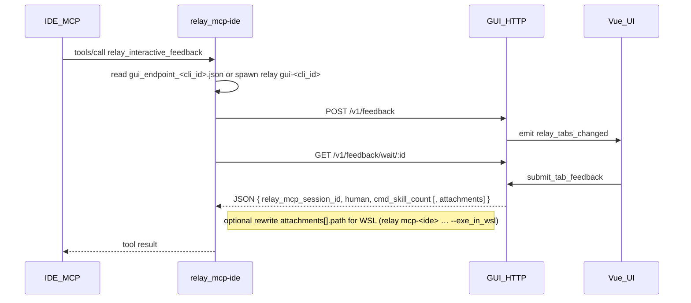

# MCP ↔ GUI: localhost HTTP

Architecture: the **MCP process** (`relay mcp-<ide>`) and **GUI process** (`relay` / `relay gui-<cli_id>`) coordinate only via HTTP on **127.0.0.1** plus on-disk **`gui_endpoint_<cli_id>.json`** (see Discovery) — no secondary child processes per request, no handshake txt, no `tab_inbox.jsonl`.



## Discovery and startup

- **Endpoint file(s)** (under the app `config_dir()` — same tree as [README / Configuration & paths](../README.md#configuration--paths)):
  - **`relay mcp-<ide>`** (e.g. `relay mcp-cursor`): **`gui_endpoint_<cli_id>.json`** — e.g. `gui_endpoint_cursor.json`, `gui_endpoint_claudecode.json`, `gui_endpoint_windsurf.json`, `gui_endpoint_other.json`. **`cli_id`** matches the `gui-<cli_id>` subcommand (`cursor`, `claudecode`, `windsurf`, `other`).
  - **No IDE mode** (e.g. some bare invocations): may use legacy **`gui_endpoint.json`**.
  - **`relay feedback`** (no IDE pre-selected): scans **all** `gui_endpoint_*.json` plus `gui_endpoint.json` until it finds a healthy GUI.
- Contents: `{ "port": u16, "token": string, "pid": u32 }`
- GUI binds **`127.0.0.1:0`**, writes a random token to the file; file is removed on process exit.
- **`relay mcp-<ide>`** reads its IDE’s file before each tool call; if missing or health fails, it **spawns** **`relay gui-<cli_id>`** and polls until timeout (~**45s** in `ensure_gui_endpoint`).
- **Security**: loopback only; token in user data dir reduces accidental connection to the wrong local process; **does not** stop a malicious local process (same as any local IPC).

## Auth

- All APIs: `Authorization: Bearer <token>` (must match the token in the active **`gui_endpoint_*.json`** / **`gui_endpoint.json`** file).

## API

### `GET /v1/health`

- 200 = endpoint is up.

### `POST /v1/feedback`

- Body JSON: `retell` (required, non-empty after trim), `relay_mcp_session_id` (optional; **string or JSON number**, empty/absent/null = new session), `commands` / `skills` (JSON arrays of `{name, id, category?, description?}`). **New session:** both properties must be present; each array should list everything the IDE can expose for slash-completion — **`[]` only when the host truly has no items** (wire format still accepts empty arrays). **Existing session:** both optional; if present, **merged** with **dedupe by `id`** (existing wins). If the last tool result had `cmd_skill_count === 0`, the client should send both arrays again repopulated the same way.
- Behavior: non-empty `relay_mcp_session_id` merges into the tab with that id and cancels the previous in-flight wait; otherwise opens a new tab and assigns a new session id (ms timestamp). Tab label = **MM-DD HH:mm:ss** from that id.
- When the GUI had only a **preview** tab and it is stripped before handling the POST: if there are **no real tabs left**, the server clears **`qa_rounds`** only for a **new** session (empty `relay_mcp_session_id`). If the IDE passes an **existing** session id (e.g. user closed the tab and MCP calls again), **only rounds for that session id are kept** so bubble history is not wiped before re-open.
- Response: `{ "request_id": "<uuid>" }`
- Empty `retell` → **400**. See [RELAY_MCP_SESSION_ID.md](RELAY_MCP_SESSION_ID.md).

### `GET /v1/feedback/wait/:request_id`

- **HTTP handler**: the Axum route **does not** apply a per-request socket timeout; it awaits a `oneshot` until the tab completes (submit, dismiss, supersede, or sender dropped).
- **60-minute idle cut-off**: when `POST /v1/feedback` returns a `request_id`, the server schedules a background task (≈ **60 min + 20 s**) that injects an **empty** `human` JSON result if the wait is still pending — same outcome as dismiss/timeout from the MCP user’s perspective (`human: ""`).
- Completes when the user submits an Answer, dismisses, that orphan task fires, or the tab is **superseded** by another `POST` for the same merged session (cancels the previous wait).
- Response: `Content-Type: application/json; charset=utf-8`, body includes **`relay_mcp_session_id`**, **`human`**, **`cmd_skill_count`**, and when the user attached images/files **`"attachments":[{"kind":"image"|"file","path":"..."}, ...]`** (`cmd_skill_count` = stored commands+skills on that tab; empty `human` on dismiss / idle timeout / supersede). Paths are local to the GUI host (Windows absolute paths). Before the IDE sees the `tools/call` result, **`relay mcp`** may **rewrite** each **`path`** to a WSL form (`/mnt/c/...`) when started with **`--exe_in_wsl`** (see below); HTTP payloads and on-disk history stay unchanged.

## MCP flow

1. Read this process’s **`gui_endpoint_<cli_id>.json`** (see Discovery); if absent or unhealthy, spawn **`relay gui-<cli_id>`** and poll.
2. `POST /v1/feedback` → `request_id`
3. `GET .../wait/:request_id` — long-lived response driven by GUI state (see above), not a fixed HTTP “61 minute” client timer.
4. Optionally transform JSON for the IDE: **`attachments[].path`** may be rewritten for **WSL-hosted agents** using Windows `relay.exe` when **`relay mcp-<ide> … --exe_in_wsl`** is used. The HTTP response body from step 3 is unchanged on disk/logging semantics except as consumed by MCP.
5. String returned as `tools/call` result.

### MCP-only: WSL path rewrite (`relay mcp-<ide> … --exe_in_wsl`)

**Windows builds only.** Start **`relay mcp-<cli_id>`** with **`--exe_in_wsl`** immediately **after** the `mcp-*` subcommand in argv (e.g. `mcp-cursor`, `mcp-claudecode`). Use this when the IDE runs the MCP client **inside WSL** but **`relay.exe` is the Windows binary**: agents need **`path`** strings they can open from Linux (e.g. `/mnt/c/Users/...` instead of `C:\Users\...`).

| Mode                                           | Behavior                                                                                                                                                                                                                                                                                                                                        |
| ---------------------------------------------- | ----------------------------------------------------------------------------------------------------------------------------------------------------------------------------------------------------------------------------------------------------------------------------------------------------------------------------------------------- |
| **`relay mcp-<ide> … --exe_in_wsl`**           | Replace each **`attachments[].path`** with the WSL `/mnt/<drive>/...` form when the value is a Windows drive path; if the string is only a Relay attachment filename or relative fragment, **`relay mcp-<ide>`** first resolves it to a canonical Windows path (same rules as reading attachments), then maps it. UNC paths are left unchanged. |
| **`relay mcp-<ide>`** (`--exe_in_wsl` omitted) | **Off** — paths in the tool result match the HTTP body (Windows).                                                                                                                                                                                                                                                                               |

**Why a CLI flag:** Environment variables from `mcp.json` are not reliably passed through to a Windows **`relay.exe`** when the IDE spawns it from WSL (e.g. `/mnt/c/.../relay.exe`). **`--exe_in_wsl`** is part of the process argv, so it always reaches the binary.

### Example: `mcp.json` (Cursor / WSL agent + Windows `relay.exe`)

Use the same **`mcp-<cli_id>`** argv as on Windows/macOS/Linux (see [`mcp_setup.rs` / CLI](../src-tauri/src/mcp_setup.rs)); append **`--exe_in_wsl`** after that subcommand when the MCP client runs **inside WSL** but **`relay.exe`** is the Windows binary:

```json
{
  "mcpServers": {
    "relay-mcp": {
      "command": "/mnt/c/Users/You/AppData/Local/Relay/relay.exe",
      "args": ["mcp-cursor", "--exe_in_wsl"],
      "autoApprove": ["relay_interactive_feedback"]
    }
  }
}
```

Use a Windows path for **`command`** when the MCP host runs on Windows; use **`/mnt/c/...`** when the host runs inside WSL. Optional **`env`** on the server entry is unrelated to this feature.

**Other IDEs:** e.g. `["mcp-claudecode", "--exe_in_wsl"]`, `["mcp-windsurf", "--exe_in_wsl"]`, `["mcp-other", "--exe_in_wsl"]` — always **after** the `mcp-*` subcommand.

### MCP client (`relay mcp` → ureq)

- The HTTP **client** in `mcp_http::feedback_round` sets a **24 h** read timeout on the `GET .../wait` call as a transport-level failsafe (avoids a truly infinite block if the GUI misbehaves). **User-visible idle timeout remains ~60 minutes** from the GUI orphan task; the 24 h ceiling should not normally be hit in practice.

## MCP stdio: concurrency, cancellation, and errors

- **Concurrent HIL**: The MCP process uses a **JSON-RPC router** plus **background workers** for long `tools/call` rounds. Multiple in-flight `relay_interactive_feedback` calls on the **same stdio connection** are supported (bounded by **`MAX_CONCURRENT_HIL`** in `server.rs`, currently **16**; beyond that, new calls get **-32603**). Each worker talks to the GUI over HTTP independently. **`tools/list`**, **`ping`**, and **`initialize`** are answered immediately on the router thread—hosts can refresh tool metadata while other tabs are waiting on you.
- **Stdout**: All JSON-RPC lines are written through a **single writer** so responses never interleave.
- **`notifications/cancelled`**: The router matches `params.requestId` (or `request_id`) to a **pending** `tools/call` by JSON-RPC `id`. It responds with **-32800** for that `id` so the host does not hang. The matching HTTP `GET .../wait` in the worker may still run until the GUI completes; the host should not assume the Relay tab closes automatically.
- Malformed JSON lines: if an `"id"` can be scraped from the line, a **-32700** parse error is returned instead of silence.

## Frontend

- `listen("relay_tabs_changed")` → `get_feedback_tabs`; no inbox polling.
- **`get_feedback_tabs` (Tauri)**: before returning state, the GUI runs `hydrate_qa_rounds_from_feedback_log`: it reads `feedback_log.txt` and, for each non-preview tab with a non-empty `relay_mcp_session_id`, merges completed MCP rounds from the log when the log has **more** completed pairs than in-memory `qa_rounds` for that session (e.g. after a GUI restart while the IDE keeps the same session id). Only `AI_REQUEST` lines that include `[session:<id>]` are attributed; see `parse_feedback_log_mcp` in `storage.rs`. Open in-memory rounds are not duplicated if the same `retell` already appears in the merged log slice. If hydration **changes** `qa_rounds`, the app emits **`relay_tabs_changed`** so the Vue layer reloads tabs and the history strip updates without a manual refresh.
- **`feedback_log.txt`**: the MCP process writes **`USER_REPLY`** as the user’s **plain Answer** (`normalize_logged_user_reply` on ingest—handles accidental full JSON bodies). **Hydration** builds `(retell, reply)` pairs from the log but **drops** lines that still look like a `feedback/wait` tool-result blob (legacy), so those rounds do not reappear in the UI. The CLI still prints the **full JSON** to stdout.
- **`qa_archive/<session_id>.jsonl`**: each time the GUI completes a round (`apply_reply_for_tab` / `skip_open_round_for_tab`), one JSON line is appended (`retell`, `reply`, `skipped`, `attachments`). On **`get_feedback_tabs` → hydrate**, if the archive has **more** completed rows than log-derived pairs for that session, the archive wins so history survives weak log pairing / skipped blob lines. **Settings → Storage**: “clear log” / “clear all” **truncates `feedback_log.txt` and deletes `*.jsonl` files under `qa_archive/`** (other filenames are left untouched); usage size for the log card sums **`feedback_log.txt` + `qa_archive` `.jsonl` bytes only**. **Attachment retention** (days) also **deletes old `qa_archive/*.jsonl` by mtime**; `feedback_log.txt` is **not** auto-pruned by age (single append-only file—manual clear or a future rotation policy).

## Removed (legacy)

- `relay window`, `result_file` / `control_file`, `tab_inbox.jsonl`, CLI retell length budget, `compute_retell_inline_hint`.
