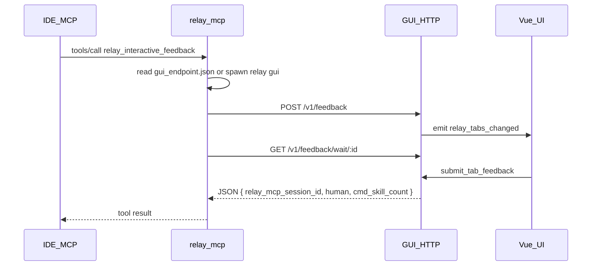

# MCP ↔ GUI: localhost HTTP

Architecture: the **MCP process** (`relay mcp`) and **GUI process** (`relay` / `relay gui`) coordinate only via HTTP on **127.0.0.1** plus on-disk **`gui_endpoint.json`** — no secondary child processes per request, no handshake txt, no `tab_inbox.jsonl`.

## Discovery and startup

- Path: `{user_data_dir}/gui_endpoint.json`
- Contents: `{ "port": u16, "token": string, "pid": u32 }`
- GUI binds **`127.0.0.1:0`**, writes a random token to the file; file is removed on process exit.
- **`relay mcp`** reads this file before each tool call; if missing or health fails, it **`spawn`s the current exe with arg `gui`**, polls until timeout (~**45s** in `ensure_gui_endpoint`).
- **Security**: loopback only; token in user data dir reduces accidental connection to the wrong local process; **does not** stop a malicious local process (same as any local IPC).

## Auth

- All APIs: `Authorization: Bearer <token>` (must match `gui_endpoint.json`).

## API

### `GET /v1/health`

- 200 = endpoint is up.

### `POST /v1/feedback`

- Body JSON: `retell` (required, non-empty after trim), `relay_mcp_session_id` (optional; empty = new session), `commands` / `skills` (JSON arrays of `{name, id, category?, description?}`). **New session:** both properties must be present; each array should list everything the IDE can expose for slash-completion — **`[]` only when the host truly has no items** (wire format still accepts empty arrays). **Existing session:** both optional; if present, **merged** with **dedupe by `id`** (existing wins). If the last tool result had `cmd_skill_count === 0`, the client should send both arrays again repopulated the same way.
- Behavior: non-empty `relay_mcp_session_id` merges into the tab with that id and cancels the previous in-flight wait; otherwise opens a new tab and assigns a new session id (ms timestamp). Tab label = **MM-DD HH:mm** from that id.
- Response: `{ "request_id": "<uuid>" }`
- Empty `retell` → **400**. See [RELAY_MCP_SESSION_ID.md](RELAY_MCP_SESSION_ID.md).

### `GET /v1/feedback/wait/:request_id`

- **HTTP handler**: the Axum route **does not** apply a per-request socket timeout; it awaits a `oneshot` until the tab completes (submit, dismiss, supersede, or sender dropped).
- **60-minute idle cut-off**: when `POST /v1/feedback` returns a `request_id`, the server schedules a background task (≈ **60 min + 20 s**) that injects an **empty** `human` JSON result if the wait is still pending — same outcome as dismiss/timeout from the MCP user’s perspective (`human: ""`).
- Completes when the user submits an Answer, dismisses, that orphan task fires, or the tab is **superseded** by another `POST` for the same merged session (cancels the previous wait).
- Response: `Content-Type: application/json; charset=utf-8`, body = `{"relay_mcp_session_id":"<ms>","human":"<Answer text>","cmd_skill_count":<n>}` (`cmd_skill_count` = stored commands+skills on that tab; empty `human` on dismiss / idle timeout / supersede).

## MCP flow

1. Read `gui_endpoint.json`; if absent, spawn **`relay gui`** and poll.
2. `POST /v1/feedback` → `request_id`
3. `GET .../wait/:request_id` — long-lived response driven by GUI state (see above), not a fixed HTTP “61 minute” client timer.
4. Body returned as `tools/call` result.

### MCP client (`relay mcp` → ureq)

- The HTTP **client** in `mcp_http::feedback_round` sets a **24 h** read timeout on the `GET .../wait` call as a transport-level failsafe (avoids a truly infinite block if the GUI misbehaves). **User-visible idle timeout remains ~60 minutes** from the GUI orphan task; the 24 h ceiling should not normally be hit in practice.

## MCP stdio: concurrency, cancellation, and errors

- **Concurrent HIL**: The MCP process uses a **JSON-RPC router** plus **background workers** for long `tools/call` rounds. Multiple in-flight `relay_interactive_feedback` calls on the **same stdio connection** are supported (bounded by **`MAX_CONCURRENT_HIL`** in `server.rs`, currently **16**; beyond that, new calls get **-32603**). Each worker talks to the GUI over HTTP independently. **`tools/list`**, **`ping`**, and **`initialize`** are answered immediately on the router thread—hosts can refresh tool metadata while other tabs are waiting on you.
- **Stdout**: All JSON-RPC lines are written through a **single writer** so responses never interleave.
- **`notifications/cancelled`**: The router matches `params.requestId` (or `request_id`) to a **pending** `tools/call` by JSON-RPC `id`. It responds with **-32800** for that `id` so the host does not hang. The matching HTTP `GET .../wait` in the worker may still run until the GUI completes; the host should not assume the Relay tab closes automatically.
- Malformed JSON lines: if an `"id"` can be scraped from the line, a **-32700** parse error is returned instead of silence.

## Frontend

- `listen("relay_tabs_changed")` → `get_feedback_tabs`; no inbox polling.

## Removed (legacy)

- `relay window`, `result_file` / `control_file`, `tab_inbox.jsonl`, CLI retell length budget, `compute_retell_inline_hint`.
