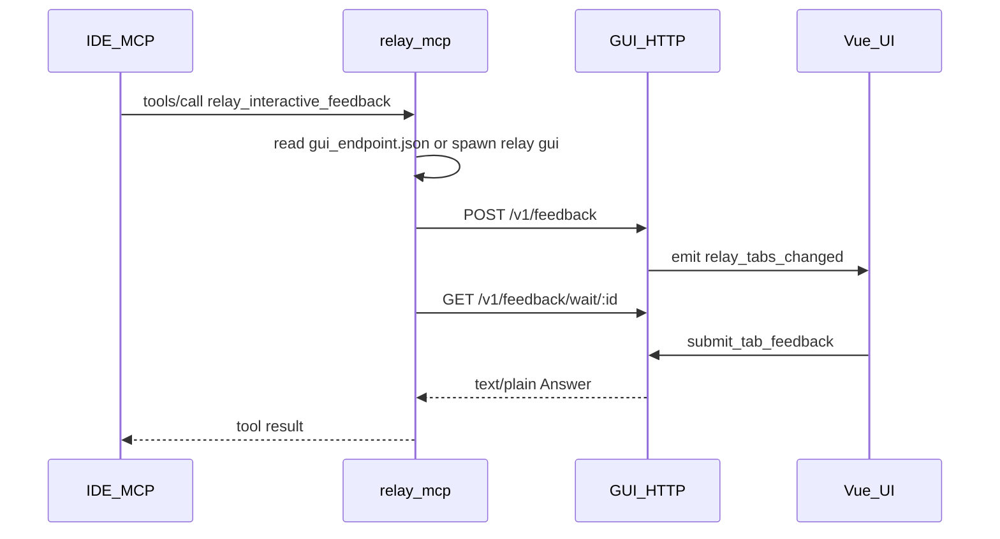

# MCP ↔ GUI：本机 HTTP

架构说明：**MCP 进程**（`relay mcp`）与 **GUI 进程**（`relay` / `relay gui`）仅通过 **127.0.0.1** 上的 HTTP + 磁盘上的 **`gui_endpoint.json`** 协作；无二次子进程、无握手 txt、无 `tab_inbox.jsonl`。

## 发现与启动

- 路径：`{user_data_dir}/gui_endpoint.json`
- 内容：`{ "port": u16, "token": string, "pid": u32 }`
- GUI 绑定 **`127.0.0.1:0`**，生成随机 token 后写入；进程退出时删除该文件。
- **`relay mcp`** 每次工具调用前读该文件；若缺失或 health 失败则 **`spawn` 当前 exe + 参数 `gui`**，轮询直至超时（约 **45s** 内 `ensure_gui_endpoint`）。
- **安全面**：仅本机回环；token 落在用户数据目录，防误连其他本机进程，**不**防本机恶意进程（与任意本地 IPC 相同）。

## 鉴权

- 所有 API：`Authorization: Bearer <token>`（与 `gui_endpoint.json` 中一致）。

## API

### `GET /v1/health`

- 200 = 端点可用。

### `POST /v1/feedback`

- Body JSON：`retell`（必填、trim 后非空）、`session_title`、`client_tab_id`（可选）。
- 行为：与历史 inbox 一致——非空 `client_tab_id` 时合并到已有 tab 并取消上一 in-flight wait（对 MCP 返回空串）；否则新 tab。
- 响应：`{ "request_id": "<uuid>" }`
- 空 `retell` → **400**。

### `GET /v1/feedback/wait/:request_id`

- 阻塞直至用户提交 Answer、关闭/dismiss（空串）、**600s** 超时、或同 tab 被新 POST 合并（旧 wait 收到空串）。
- 响应：`Content-Type: text/plain; charset=utf-8`，body = Answer。

## MCP 流程

1. 读 `gui_endpoint.json`；若无则 spawn **`relay gui`** 并轮询。
2. `POST /v1/feedback` → `request_id`
3. `GET .../wait/:request_id`（长阻塞，ureq 超时约 700s）
4. body 作为 `tools/call` 结果返回。

## 前端

- `listen("relay_tabs_changed")` → `get_feedback_tabs`；不再轮询 inbox。

## 已移除（旧版）

- `relay window`、`result_file` / `control_file`、`tab_inbox.jsonl`、命令行 retell 长度预算、`compute_retell_inline_hint`。
