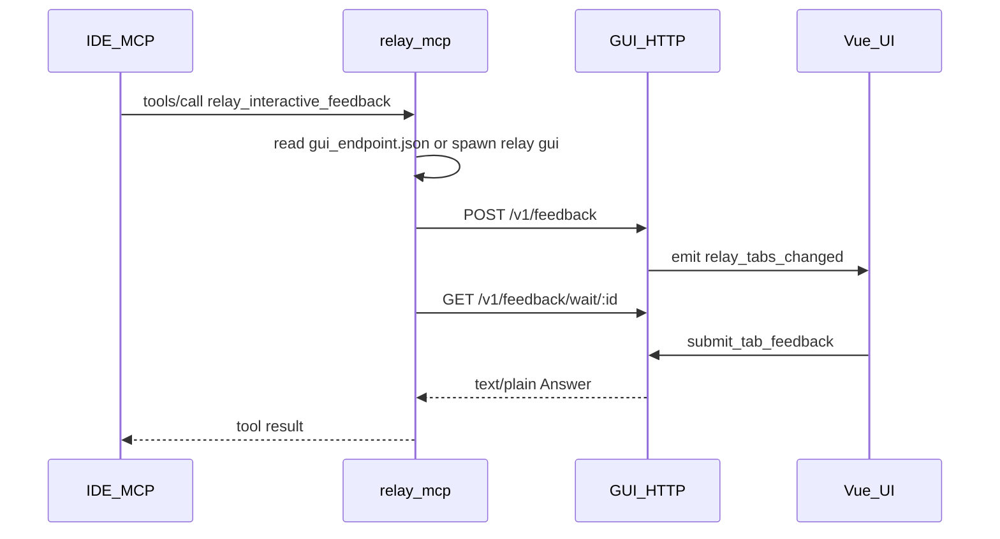

# MCP ↔ GUI: localhost HTTP

Architecture: the **MCP process** (`relay mcp`) and **GUI process** (`relay` / `relay gui`) coordinate only via HTTP on **127.0.0.1** plus on-disk **`gui_endpoint.json`** — no secondary child processes per request, no handshake txt, no `tab_inbox.jsonl`.

## Discovery and startup

- Path: `{user_data_dir}/gui_endpoint.json`
- Contents: `{ "port": u16, "token": string, "pid": u32 }`
- GUI binds **`127.0.0.1:0`**, writes a random token to the file; file is removed on process exit.
- **`relay mcp`** reads this file before each tool call; if missing or health fails, it **`spawn`s the current exe with arg `gui`**, polls until timeout (~**45s** in `ensure_gui_endpoint`).
- **Security**: loopback only; token in user data dir reduces accidental connection to the wrong local process; **does not** stop a malicious local process (same as any local IPC).

## Auth

- All APIs: `Authorization: Bearer <token>` (must match `gui_endpoint.json`).

## API

### `GET /v1/health`

- 200 = endpoint is up.

### `POST /v1/feedback`

- Body JSON: `retell` (required, non-empty after trim), `session_title` (optional, **GUI ignores**, legacy clients), `client_tab_id` (optional).
- Behavior: non-empty `client_tab_id` merges into the tab with that id and cancels the previous in-flight wait (MCP may get empty string); otherwise opens a new tab.
- **Title:** GUI assigns **Chat 1**, **Chat 2**, … (global increment); each `client_tab_id` binds to a number on first use, then reuses it. Empty `client_tab_id` → new tab gets the next number. See [CLIENT_TAB_ID.md](CLIENT_TAB_ID.md).
- Response: `{ "request_id": "<uuid>" }`
- Empty `retell` → **400**.

### `GET /v1/feedback/wait/:request_id`

- Blocks until the user submits an Answer, closes/dismisses (empty string), **600s** timeout, or the tab is superseded by another POST (old wait gets empty string).
- Response: `Content-Type: text/plain; charset=utf-8`, body = Answer.

## MCP flow

1. Read `gui_endpoint.json`; if absent, spawn **`relay gui`** and poll.
2. `POST /v1/feedback` → `request_id`
3. `GET .../wait/:request_id` (long poll, ureq timeout ~700s)
4. Body returned as `tools/call` result.

## Frontend

- `listen("relay_tabs_changed")` → `get_feedback_tabs`; no inbox polling.

## Removed (legacy)

- `relay window`, `result_file` / `control_file`, `tab_inbox.jsonl`, CLI retell length budget, `compute_retell_inline_hint`.
