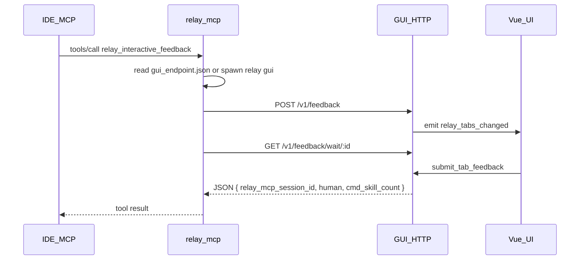

# MCP ↔ GUI: localhost HTTP

Architecture: the **MCP process** (`relay mcp`) and **GUI process** (`relay` / `relay gui`) coordinate only via HTTP on **127.0.0.1** plus on-disk **`gui_endpoint.json`** — no secondary child processes per request, no handshake txt, no `tab_inbox.jsonl`.

## Discovery and startup

- Path: `{user_data_dir}/gui_endpoint.json`
- Contents: `{ "port": u16, "token": string, "pid": u32 }`
- GUI binds **`127.0.0.1:0`**, writes a random token to the file; file is removed on process exit.
- **`relay mcp`** reads this file before each tool call; if missing or health fails, it **`spawn`s the current exe with arg `gui`**, polls until timeout (~**45s** in `ensure_gui_endpoint`).
- **Security**: loopback only; token in user data dir reduces accidental connection to the wrong local process; **does not** stop a malicious local process (same as any local IPC).

## Auth

- All APIs: `Authorization: Bearer <token>` (must match `gui_endpoint.json`).

## API

### `GET /v1/health`

- 200 = endpoint is up.

### `POST /v1/feedback`

- Body JSON: `retell` (required, non-empty after trim), `relay_mcp_session_id` (optional; empty = new session), `commands` / `skills` (JSON arrays of `{name, id, category?, description?}`). **New session:** both required (either may be `[]`). **Existing session:** both optional; if present, **merged** into that tab’s lists with **dedupe by `id`** (existing wins, duplicate `id` from request is skipped).
- Behavior: non-empty `relay_mcp_session_id` merges into the tab with that id and cancels the previous in-flight wait; otherwise opens a new tab and assigns a new session id (ms timestamp). Tab label = **MM-DD HH:mm** from that id.
- Response: `{ "request_id": "<uuid>" }`
- Empty `retell` → **400**. See [RELAY_MCP_SESSION_ID.md](RELAY_MCP_SESSION_ID.md).

### `GET /v1/feedback/wait/:request_id`

- Blocks until the user submits an Answer, dismisses, **60 min** timeout (default), or the tab is superseded by another POST.
- Response: `Content-Type: application/json; charset=utf-8`, body = `{"relay_mcp_session_id":"<ms>","human":"<Answer text>","cmd_skill_count":<n>}` (`cmd_skill_count` = stored commands+skills on that tab; empty `human` on dismiss/timeout).

## MCP flow

1. Read `gui_endpoint.json`; if absent, spawn **`relay gui`** and poll.
2. `POST /v1/feedback` → `request_id`
3. `GET .../wait/:request_id` (long poll, ureq timeout ~61 min)
4. Body returned as `tools/call` result.

## Frontend

- `listen("relay_tabs_changed")` → `get_feedback_tabs`; no inbox polling.

## Removed (legacy)

- `relay window`, `result_file` / `control_file`, `tab_inbox.jsonl`, CLI retell length budget, `compute_retell_inline_hint`.
